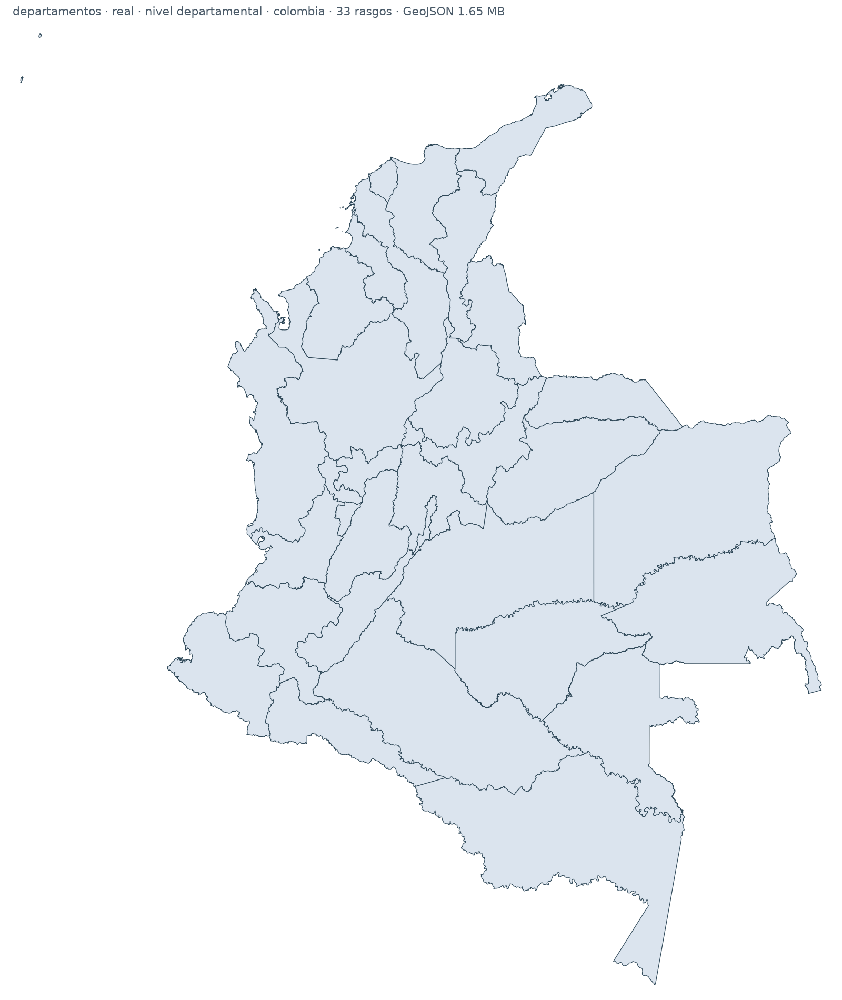
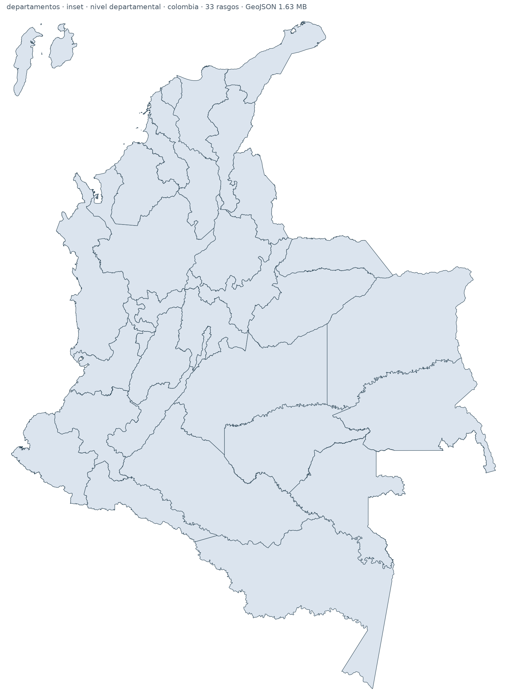
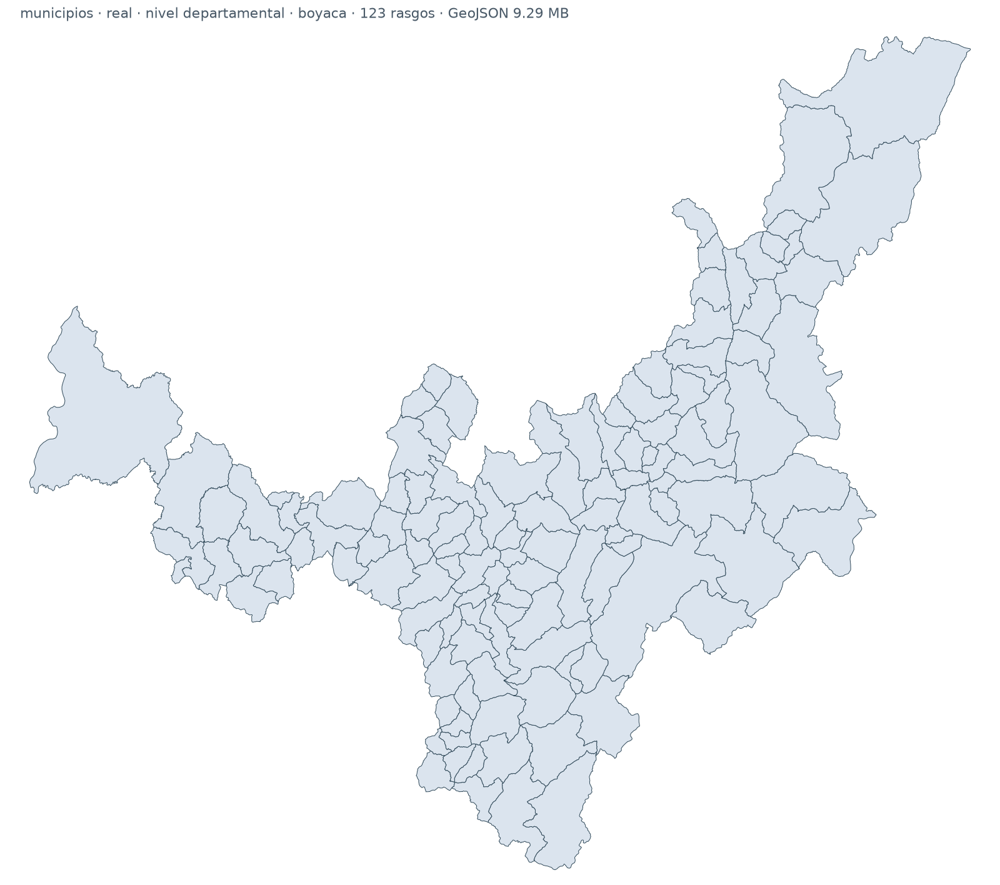
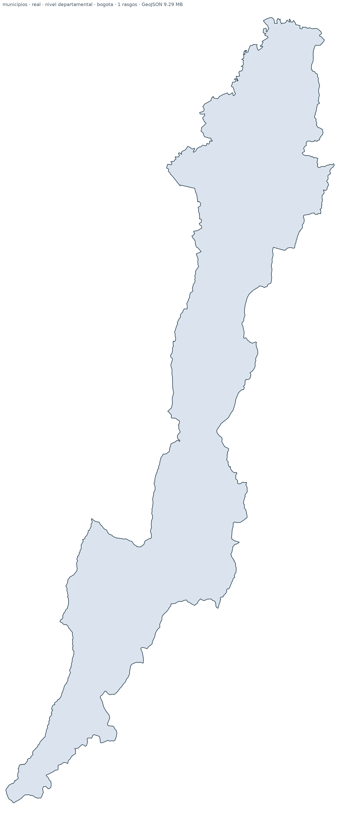

# Mapas de Colombia — MGN 2025

Mapas de Colombia listos para usar en coropletas, derivados del **Marco
Geoestadístico Nacional 2025 del DANE**. Departamentos y municipios, en GeoJSON
y TopoJSON, simplificados en tres niveles de detalle y con el archipiélago de
San Andrés en su posición real o ampliado como recuadro.

**No hace falta instalar nada.** Los archivos ya están generados en este
repositorio: descarga el que necesites y úsalo en Power BI, Tableau, D3,
Plotly, Leaflet, QGIS o donde quieras.

|  |  |
|:---:|:---:|
| variante `real` | variante `inset` |

---

## Descarga rápida

Si no quieres leer nada más, estos cuatro archivos cubren la mayoría de los
casos. Son la variante `inset` (San Andrés visible) al nivel `nacional`
(el más ligero, indistinguible del original cuando se ve Colombia completa):

| Qué | Formato | Tamaño | Descarga |
|---|---|---|---|
| 1.122 municipios | GeoJSON | 2,5 MB | [`col_municipios_inset_nacional.geojson`](output/geojson/col_municipios_inset_nacional.geojson) |
| 1.122 municipios | TopoJSON | 0,84 MB | [`col_municipios_inset_nacional.topojson`](output/topojson/col_municipios_inset_nacional.topojson) |
| 33 departamentos | GeoJSON | 0,40 MB | [`col_departamentos_inset_nacional.geojson`](output/geojson/col_departamentos_inset_nacional.geojson) |
| 33 departamentos | TopoJSON | 0,12 MB | [`col_departamentos_inset_nacional.topojson`](output/topojson/col_departamentos_inset_nacional.topojson) |

En GitHub, para bajar el archivo hay que entrar al enlace y pulsar **Download
raw file**. Para enlazarlo desde código o desde una herramienta, usa la URL
`raw`:

```
https://raw.githubusercontent.com/ytolosa/mapas-colombia/main/output/geojson/col_municipios_inset_nacional.geojson
```

El [catálogo completo](#cat%C3%A1logo-completo) tiene las 24 combinaciones.

## Cómo usarlos

Todos los archivos traen el **código DIVIPOLA** del DANE, que es la llave para
unirlos con tus datos. Viene en dos formas —`"05001"` como texto y `5001` como
entero— porque muchas herramientas se comen el cero de la izquierda. Usa la
que coincida con tu tabla.

### Power BI

Usa los archivos **TopoJSON** con el visual **Shape map**. Pesan 3 o 4 veces
menos que el GeoJSON equivalente, que en un informe de Power BI se nota:

1. Añade un visual **Shape map** al lienzo.
2. En **Formato del visual → Configuración del mapa → Tipo de mapa**, elige
   **Mapa personalizado** y carga el `.topojson`. También puedes elegir **URL**
   y pegar el enlace `raw` de arriba, sin descargar nada.
3. Arrastra tu columna de código DIVIPOLA al campo **Ubicación** y tu medida a
   **Saturación de color**.
4. Usa **Ver clave de tipo de mapa** para comprobar que los valores de tu
   columna coinciden con los del archivo.

Dos cosas que conviene saber antes de empezar:

- Shape map dibuja **como máximo 1.500 regiones**. Los 1.122 municipios caben,
  pero sin margen: si además filtras o agregas, verifica que no se te queden
  polígonos fuera.
- Empieza por el nivel `nacional`. Los niveles más pesados no se ven mejor en
  un tablero y sí hacen lento el informe.

Si tu columna de código es texto con ceros (`"05001"`), une por `divipola_mun`.
Si Power BI ya te la importó como número (`5001`), une por `divipola_mun_n`.

### Herramientas web (D3, Plotly, Highcharts, Observable)

Usa **TopoJSON**: pesa entre 3 y 4 veces menos y garantiza que las fronteras
entre municipios vecinos encajen sin huecos.

```js
const topo = await fetch(
  "https://raw.githubusercontent.com/ytolosa/mapas-colombia/main/output/topojson/col_municipios_inset_nacional.topojson"
).then(r => r.json());

const municipios = topojson.feature(topo, topo.objects[Object.keys(topo.objects)[0]]);
```

### Tableau, Looker Studio, QGIS, ArcGIS

Usa **GeoJSON**: se abre directamente como origen de datos espaciales y luego
se une por `divipola_mun` o `divipola_dep`.

### Python

```python
import geopandas as gpd

url = "https://raw.githubusercontent.com/ytolosa/mapas-colombia/main/output/geojson/col_municipios_real_nacional.geojson"
mpios = gpd.read_file(url)

mpios.merge(mis_datos, on="divipola_mun").plot(column="valor", legend=True)
```

Para cálculos de área, distancia o vecindad usa siempre la variante **`real`**,
nunca `inset`.

---

## Qué archivos hay

Cada archivo combina tres cosas:

- **Capa**: `departamentos` (33) o `municipios` (1.122).
- **Variante**: `real` o `inset`.
- **Nivel de detalle**: `municipal`, `departamental` o `nacional`.

Eso da 12 combinaciones, cada una en GeoJSON y TopoJSON:

```
output/geojson/col_municipios_inset_nacional.geojson
output/topojson/col_municipios_inset_nacional.topojson
```

Más los previews PNG a tres escalas —Colombia completa, Boyacá y Bogotá D.C.—
para comparar los niveles de un vistazo:

```
output/previews/colombia/col_municipios_inset_nacional_colombia.png
output/previews/boyaca/col_municipios_real_nacional_boyaca.png
output/previews/bogota/col_municipios_real_nacional_bogota.png
```

Los recortes de Boyacá y Bogotá existen solo en la variante `real`: el
archipiélago no entra en el encuadre, así que `inset` daría la misma imagen.

### Qué nivel usar

Cada nivel lleva el nombre de **la escala a la que se ve el mapa**, que es lo
que decide el detalle necesario. Si vas a mostrar Colombia completa, `nacional`
se ve igual que el dato original y pesa 12 veces menos.

| Nivel | Vértices | Para qué | Municipios GeoJSON | Municipios TopoJSON |
|---|---|---|---|---|
| `municipal` | 25 % | Zoom a un municipio, impresión, trabajo vectorial | 31,34 MB | 7,53 MB |
| `departamental` | 8 % | Un departamento en pantalla | 9,29 MB | 2,43 MB |
| `nacional` | 2 % | Colombia completa: BI y web | 2,50 MB | 0,84 MB |

### Cómo se ven los tres niveles

**Un departamento en pantalla: los 123 municipios de Boyacá.**

| `municipal` — 31,34 MB | `departamental` — 9,29 MB | `nacional` — 2,50 MB |
|:---:|:---:|:---:|
|  |  |  |
| Cada recodo del borde intacto | Indistinguible del anterior | Bordes rectos al comparar de cerca |

Entre `municipal` y `departamental` no hay diferencia apreciable a esta escala,
pese a que el archivo pesa 3,4 veces menos. El primer salto que se nota está en
`nacional`, y aun así el mapa sigue siendo perfectamente usable para un
departamento con un archivo 12 veces más liviano.

**Un municipio en pantalla: Bogotá D.C.**, de la sabana al páramo de Sumapaz.

| `municipal` — 3.890 vértices | `departamental` — 1.177 vértices | `nacional` — 294 vértices |
|:---:|:---:|:---:|
|  |  |  |
| Borde microdentado completo | Dentado suavizado, silueta igual | Segmentos rectos evidentes |

Aquí sí se ve para qué sirve `municipal`: conserva el dentado fino del borde
oriental, sobre los cerros. `departamental` lo suaviza —hay que comparar lado a
lado para notarlo— y `nacional` ya reduce el contorno a tramos rectos que saltan
a la vista. Si tu mapa se va a ver a esta escala, usa `municipal`.

Pulsa cualquier imagen para verla a tamaño completo; en miniatura las diferencias
desaparecen, que es precisamente el argumento. A escala **nacional** —los
previews de `output/previews/colombia/`— los tres niveles se ven idénticos, y el
más ligero conserva la silueta del país y los 1.122 municipios.

Solo hay tres niveles porque solo se distinguen tres: añadir un nivel intermedio
produciría archivos distintos en bytes e iguales en pantalla. El razonamiento
completo está en **[docs/guia-calidad.md](docs/guia-calidad.md)**.

### Las dos variantes: `real` e `inset`

El archipiélago de San Andrés y Providencia queda a unos 700 km de la costa. En
un mapa de Colombia completa eso significa dos puntos casi invisibles en una
esquina: San Andrés mide 13 km de largo, menos del 1 % de la altura del mapa.

- **`real`** conserva la posición geográfica verdadera. Es la que debes usar
  para cualquier cálculo espacial.
- **`inset`** acerca el archipiélago al continente y lo amplía **15 veces**,
  con lo que San Andrés pasa a ocupar cerca del 10 % de la altura del mapa. Es
  una convención cartográfica: el archipiélago se ve, pero sus coordenadas ya
  no son las reales.

El archipiélago va anclado **dentro** del rectángulo que ocupa el continente, en
el hueco de mar Caribe del noroeste, a 2,2° de tierra firme. Así el inset no
solo hace visibles las islas: además reduce el encuadre, porque el cuadro del
mapa pasa a ser exactamente el del continente.

| Variante | Ancho | Alto | Área del cuadro |
|---|---|---|---|
| `real` | 14,89° | 17,62° | 100 % |
| `inset` | 12,16° | 16,69° | 77 % |

La ampliación se hace isla por isla, no como un solo bloque: San Andrés y
Providencia están a unos 95 km una de otra, y al ampliar x15 esa separación
pasaría de 1.400 km. Cada isla se escala sobre su propio centro y luego quedan
lado a lado, alineadas por arriba y en su orden geográfico oeste-este. El
enfoque sigue el del notebook
[jacasta2/colombian_map](https://github.com/jacasta2/colombian_map/blob/main/from_shapefiles/create_from_shapefile.ipynb),
que acerca San Andrés a Providencia dejando un espacio fijo entre ambas.

### Campos

Todos los archivos llevan el código DIVIPOLA en dos formas: como texto con
ceros a la izquierda y como entero.

| Campo | Tipo | Ejemplo |
|---|---|---|
| `divipola_mun` | texto, 5 caracteres | `"05001"` |
| `divipola_mun_n` | entero | `5001` |
| `divipola_dep` | texto, 2 caracteres | `"05"` |
| `divipola_dep_n` | entero | `5` |
| `mpio_nombre` | texto | `"MEDELLÍN"` |
| `dpto_nombre` | texto | `"ANTIOQUIA"` |
| `area_km2` | decimal | `374.7415` |

La capa departamental lleva solo los campos de departamento. Detalle completo en
**[docs/diccionario-datos.md](docs/diccionario-datos.md)**.

Sistema de referencia: **EPSG:4326 (WGS 84)**, heredado del MGN.

### Catálogo completo

El nombre de archivo sigue siempre el patrón
`col_{capa}_{variante}_{nivel}.{formato}`:

| Capa | Variante | Nivel | GeoJSON | TopoJSON |
|---|---|---|---|---|
| departamentos | real | nacional | 0,40 MB | 0,12 MB |
| departamentos | real | departamental | 1,65 MB | 0,47 MB |
| departamentos | real | municipal | 5,65 MB | 1,57 MB |
| departamentos | inset | nacional | 0,40 MB | 0,12 MB |
| departamentos | inset | departamental | 1,63 MB | 0,48 MB |
| departamentos | inset | municipal | 5,57 MB | 1,60 MB |
| municipios | real | nacional | 2,50 MB | 0,84 MB |
| municipios | real | departamental | 9,29 MB | 2,43 MB |
| municipios | real | municipal | 31,34 MB | 7,53 MB |
| municipios | inset | nacional | 2,49 MB | 0,85 MB |
| municipios | inset | departamental | 9,25 MB | 2,47 MB |
| municipios | inset | municipal | 31,22 MB | 7,60 MB |

Todos están en [`output/geojson/`](output/geojson/) y
[`output/topojson/`](output/topojson/).

---

## Licencia y atribución

Este repositorio distribuye dos cosas con licencias distintas:

| Qué | Licencia |
|---|---|
| Código del pipeline (`mapas.py`, `scripts/`, `docs/`) | [MIT](LICENSE) |
| Datos generados (`output/`) | [CC BY 4.0](LICENSE-DATA.md) |

Puedes usar los mapas **para lo que quieras, incluido uso comercial**, sin pedir
permiso. Lo único que se te pide es dar crédito:

```
Cartografía: Marco Geoestadístico Nacional 2025, DANE
(Fuente: Departamento Administrativo Nacional de Estadística: www.dane.gov.co).
Simplificación: https://github.com/ytolosa/mapas-colombia, CC BY 4.0.
```

La primera línea es la que no puede faltar: es la condición que pone el DANE.

### Sobre la fuente

Los datos provienen del **Marco Geoestadístico Nacional (MGN) 2025** del
Departamento Administrativo Nacional de Estadística de Colombia, publicado en su
geoportal:

**<https://geoportal.dane.gov.co/servicios/descarga-y-metadatos/datos-geoestadisticos/?cod=111>**

Los [términos de uso del DANE](https://www.dane.gov.co/index.php/servicios-al-ciudadano/tramites/transparencia-y-acceso-a-la-informacion-publica/terminos-y-condiciones)
autorizan «el uso, aprovechamiento, transformación y análisis» de su información
a condición de citar la fuente. Estos archivos son exactamente eso: una
transformación, publicada con la cita.

Los shapefiles originales **no se redistribuyen aquí**; se descargan del
geoportal. Lo que este repositorio publica son archivos derivados:
simplificados, con los campos renombrados y, en la variante `inset`, con el
archipiélago desplazado.

**El DANE no produce, avala ni respalda estos archivos.** Cualquier error de
simplificación es de este repositorio. Para uso oficial, catastral o legal,
acude siempre al shapefile del DANE. Detalles en
[LICENSE-DATA.md](LICENSE-DATA.md).

---

## Regenerar los archivos

Todo lo que sigue es opcional: solo hace falta si quieres cambiar los
parámetros, actualizar a una edición futura del MGN o auditar cómo se
generaron los archivos.

### Los datos de partida

Descarga el MGN 2025 del
[geoportal del DANE](https://geoportal.dane.gov.co/servicios/descarga-y-metadatos/datos-geoestadisticos/?cod=111)
y descomprímelo en `shapefiles MGN/` con esta estructura:

```
shapefiles MGN/
├── MGN2025_DPTO_POLITICO/
│   ├── MGN_ADM_DPTO_POLITICO.shp      17 MB
│   ├── MGN_ADM_DPTO_POLITICO.dbf
│   ├── MGN_ADM_DPTO_POLITICO.shx
│   ├── MGN_ADM_DPTO_POLITICO.prj
│   └── MGN_ADM_DPTO_POLITICO.cpg
└── MGN2025_MPIO_GRAFICO/
    ├── MGN_ADM_MPIO_GRAFICO.shp       99 MB
    ├── MGN_ADM_MPIO_GRAFICO.dbf
    ├── MGN_ADM_MPIO_GRAFICO.shx
    ├── MGN_ADM_MPIO_GRAFICO.prj
    └── MGN_ADM_MPIO_GRAFICO.cpg
```

Los cinco archivos de cada capa son los imprescindibles: `.shp` (geometría),
`.dbf` (atributos), `.shx` (índice), `.prj` (sistema de referencia) y `.cpg`
(codificación, UTF-8). Si el ZIP del DANE trae además `.sbn`, `.sbx` o
`.shp.xml`, puedes dejarlos: no estorban.

Si los nombres de las carpetas o de los archivos cambian en una edición futura
del MGN, ajusta `SHP_DPTO` y `SHP_MPIO` en `scripts/config.py`.

### Ejecutar el pipeline

Requisitos: Python 3.12+ y Node 18+. Un solo comando instala lo demás:

```bash
python3 mapas.py setup    # crea .venv, instala dependencias de Python y mapshaper
python3 mapas.py          # pipeline completo (~15 min)
```

No hace falta activar el entorno virtual ni usar `make`: `mapas.py` se vuelve a
lanzar solo con el intérprete de `.venv`.

Cada paso se puede ejecutar por separado, y los tres aceptan `--layers`,
`--variants` y `--levels` para regenerar solo una parte:

```bash
python3 mapas.py prepare                                    # shapefiles -> maestro en build/
python3 mapas.py build --layers departamentos               # maestro -> geojson y topojson
python3 mapas.py render --layers municipios --levels nacional
python3 mapas.py verify                                     # campos, conteos y archivos
python3 mapas.py clean                                      # borra los intermedios de build/
```

Los municipios tardan mucho más que los departamentos (99 MB de shapefile,
6,2 millones de vértices). Al probar un cambio, empieza por
`--layers departamentos`.

El pipeline completo necesita ~1 GB libre para los intermedios de `build/`.

### Cómo funciona

```
shapefiles MGN/          prepare.py          build.py            render.py
  MGN_ADM_DPTO   ──▶  GeoJSON maestro  ──▶  geojson/       ──▶  previews/
  MGN_ADM_MPIO        (real + inset)        topojson/            png + svg
```

1. **`scripts/prepare.py`** lee los shapefiles, renombra los atributos a los
   campos DIVIPOLA del proyecto, valida los códigos y construye la variante
   `inset`. No simplifica nada.
2. **`scripts/build.py`** llama a mapshaper. Los tres niveles de una capa salen
   de una sola invocación encadenando `-simplify`, lo que además deja los
   niveles anidados entre sí: los vértices de `nacional` son un subconjunto de
   los de `departamental`.
3. **`scripts/render.py`** dibuja los previews con matplotlib.
4. **`scripts/verify.py`** comprueba campos, conteos y archivos faltantes.

`scripts/config.py` centraliza los niveles, las rutas y los parámetros del
inset (`SA_SCALE`, `SA_ANCHOR_LON`, `SA_ANCHOR_LAT`, `SA_GAP`). Es el archivo
que hay que tocar para cambiar el comportamiento. Si mueves el inset, el
pipeline falla cuando el archipiélago queda a menos de 0,5° del continente,
para que un inset mal ubicado no pase inadvertido.

Los previews en SVG no se versionan —pesan 78 MB en total— pero se generan con
`python3 mapas.py render` si los necesitas para trabajo vectorial.

## Contribuir

Los reportes de errores son bienvenidos, sobre todo los geométricos: si ves un
hueco entre municipios, una isla que falta o un polígono deformado, abre un
issue con una captura y el nombre del archivo.

Si quieres proponer un cambio en el pipeline, empieza por `scripts/config.py`:
casi todo el comportamiento —niveles, rutas, campos, parámetros del inset,
ámbitos de preview— se controla desde ahí. Ten en cuenta que la simplificación
se hace con mapshaper.
